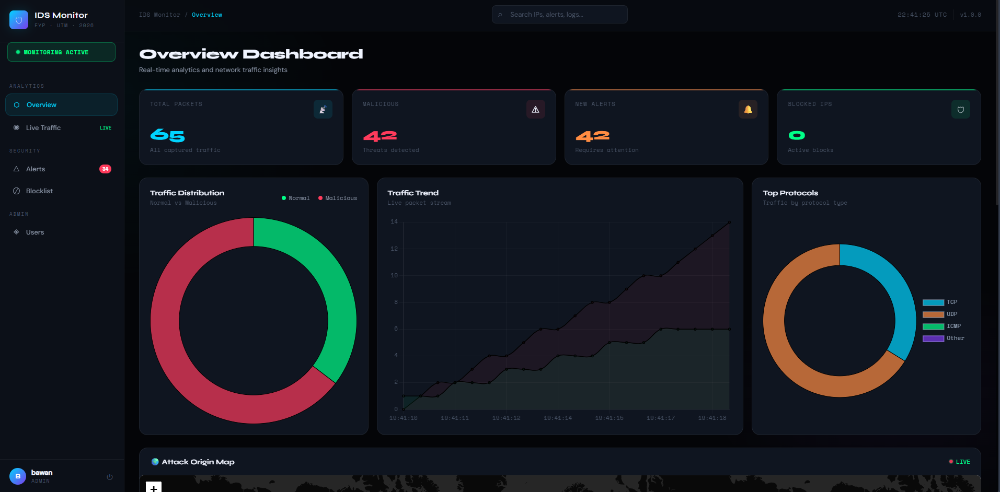
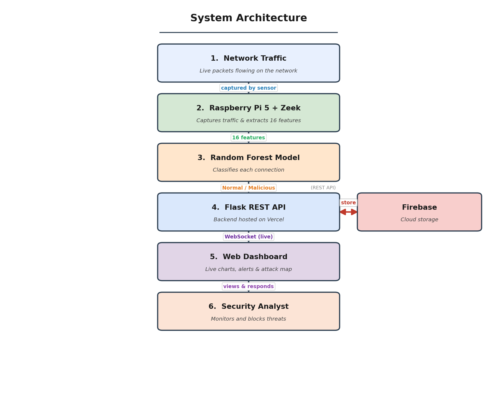
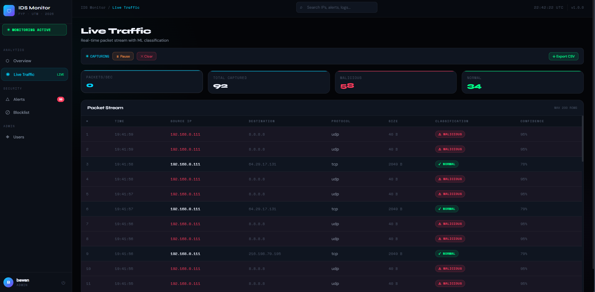

# 🛡️ ML-Based Network Intrusion Detection System (IDS)

A real-time, machine-learning-powered Intrusion Detection System that monitors live network traffic, detects malicious activity using a Random Forest model, and visualizes everything through a modern web dashboard. Built on affordable hardware (Raspberry Pi 5), this project demonstrates that effective network security can be achieved without expensive enterprise equipment.



---

## 📖 About The Project

Network attacks such as port scanning and brute-force attempts are growing every day, yet most existing Intrusion Detection Systems are expensive, complex, and difficult to deploy in small or educational environments. This project solves that problem with a lightweight, affordable, and easy-to-use IDS.

A **Raspberry Pi 5** is connected directly to the network router and continuously captures live traffic using **Zeek**. Each connection is classified as *normal* or *malicious* by a pre-trained **Random Forest** model. Results are sent to a **Flask** backend, stored in **Firebase**, and displayed instantly on a real-time **web dashboard** — complete with live charts, alerts, an attack-origin world map, and IP blocking.

---

## ✨ Features

- **Real-time traffic monitoring** — live packet stream with ML classification
- **Machine learning detection** — Random Forest model with 99.34% accuracy
- **Interactive dashboard** — live statistics, charts, and traffic trends
- **Attack origin map** — world map showing where threats come from
- **Alert management** — acknowledge and resolve security alerts
- **IP blocklist** — manually block malicious IP addresses
- **User management** — admin and viewer roles
- **CSV export** — download traffic logs by date range
- **Remote control** — start/stop monitoring from the dashboard
- **Password reset** — secure email-based password recovery

---

## 🏗️ System Architecture



---

## 🛠️ Technologies Used

**Hardware**
- Raspberry Pi 5 (network sensor)

**Machine Learning**
- Python, scikit-learn, pandas
- Random Forest classifier
- UNSW-NB15 dataset

**Network Capture**
- Zeek (network flow analysis)

**Backend**
- Flask (REST API)
- Flask-SocketIO (WebSocket)
- Firebase Firestore (database)
- Vercel (hosting)

**Frontend**
- HTML, CSS, JavaScript
- Chart.js (charts)
- Leaflet.js (world map)

---

## ⚙️ How It Works

1. **Capture** — Zeek runs on the Raspberry Pi and monitors all traffic passing through the router, writing connection records to a log file.
2. **Extract** — A Python script reads the Zeek log in real time and extracts 16 network flow features from each connection.
3. **Classify** — The trained Random Forest model classifies each connection as normal or malicious with a confidence score.
4. **Transmit** — Results are sent to the Flask backend via a REST API over the internet.
5. **Store** — The backend keeps recent data in memory for speed and writes everything to Firebase for permanent storage.
6. **Visualize** — The dashboard receives live updates through WebSocket and displays them instantly without needing to refresh.

---

## 📊 Model Performance

The Random Forest model was trained on the UNSW-NB15 dataset using a 70:30 train-test split.

| Metric | Value |
|--------|-------|
| Accuracy | 99.34% |
| Detection Rate (Recall) | 96.88% |
| False Positive Rate | 0.30% |
| Precision | 99.22% |
| F1-Score | 98.04% |

---

## 📸 Screenshots

| Overview Dashboard | Live Traffic |
|--------------------|--------------|
|  |  |

---

## 🚀 Getting Started

### Prerequisites
- Raspberry Pi 5 with Zeek installed
- Python 3.10+
- A Firebase project
- A Vercel account (for deployment)

### Backend Setup
```bash
# Clone the repository
git clone https://github.com/bawan-othman/ids-monitor.git
cd ids-monitor

# Install dependencies
pip install -r requirements.txt

# Add your Firebase key as firebase-key.json
# Set environment variables: FIREBASE_KEY, MAIL_EMAIL, MAIL_PASSWORD

# Run the server
python app.py
```

### Raspberry Pi Setup
```bash
# Install Zeek and Python dependencies
# Place the trained model at model/ids_model_v5.pkl

# Run the IDS watcher service
python watcher.py
```

---

## 🔬 Attack Simulation

The system was validated using a SYN flood attack generated with **Scapy** from a separate machine on the network. The IDS detected the attack within seconds, generated a high-confidence alert, and displayed it on the dashboard — confirming the complete pipeline works under real attack conditions.

---

## 👤 Author

**Bawan Othman Ali**
Computer Network & Security
Qaiwan International University, Sulaymaniyah, Iraq

- GitHub: [@bawan-othman](https://github.com/bawan-othman)

---

## 📝 License

This project is for educational purposes as part of a Final Year Project (FYP).

---

⭐ If you found this project interesting, please consider giving it a star!
